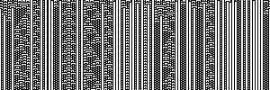

# cellular automata generator (in Go)

> **More documentation about Automata and their implementation on [eliseduverdier.github.io/cellular-automata-go/](https://eliseduverdier.github.io/cellular-automata-go/).**


[](https://codecov.io/gh/eliseduverdier/cellular-automata-go)
[](https://goreportcard.com/report/github.com/eliseduverdier/cellular-automata-go)
[](https://codeclimate.com/github/eliseduverdier/cellular-automata-go/maintainability)

Generates [elementary cellular automata](https://en.wikipedia.org/wiki/Elementary_cellular_automaton) images, with 2 to 9 states, or 1st and 2nd order, with customizable size, ~colors~, and points distribution, using Go

- As PNG images (rule 73)

  

- Or as text (rule 110)

```
██ █ █    ██  ███ █ ███   ██ █ █   ██   █  ██
       █  █  ██         █ █      █ █  █ █ ██
      █ ██ ██  █       █   █    █   ██      █
     █       ██ █     █ █ █ █  █ █ █  █    █ █
    █ █     █    █   █       ██     ██ █  █   █
   █   █   █ █  █ █ █ █     █  █   █    ██ █ █
  █ █ █ █ █   ██       █   █ ██ █ █ █  █
 █         █ █  █     █ █ █          ██ █
█ █       █   ██ █   █     █        █    █    █
   █     █ █ █    █ █ █   █ █      █ █  █ █  █
█ █ █   █     █  █     █ █   █    █   ██   ██
     █ █ █   █ ██ █   █   █ █ █  █ █ █  █ █  █
    █     █ █      █ █ █ █     ██     ██   ██
   █ █   █   █    █       █   █  █   █  █ █  █
█ █   █ █ █ █ █  █ █     █ █ █ ██ █ █ ██   ██ █
```

## Use locally

```shell
go run main.go
```

Then go to http://localhost:8888/text or http://localhost:8888/image and use GET parameters (listed below)

Or use in the shell with

```shell
go run main.go --shell
```

This will generate an image in `images/` (or a text directly with the `-render=text` flag)

### command line options & get parameters

Example: `go run main.go -s=5 -o=2 -r=12345 -w=30 -h=10 -render=text` will render the automata #12345 of 2nd order with 5 sates, in text directly to the console, showing 30 columns of characters, and 10 rows.
option | role
-------|------
s | number of states ()>2)
o | order (1 or 2)
r | rule number
w | width in pixels
h | height in pixels
render | 'image' or 'text' for shell environement only
start | first line strategy ("random", "centered", or "custom", see below)
line | if no start strategy is defined, we expect a sequence of numbers representing the first line "0..." by default

## Run tests

```shell
# Run test recursively in all subfolders
go test ./...
# generate code coverage
go test -v -coverprofile test-coverage.html ./...
# display code coverage as html
go tool cover -html=coverage.out
```

# Etc

## Todo

- [ ] add docker
- [x] code coverage
- [ ] add option to get dots bigger than 1px
- [ ] add option to choose custom colors
- [x] add stragety pattern for the first line (random|centered|custom)
- [x] add end point to get custom first line
- [ ] add a way to generate the automata on demand from the custom first line

### install latest go version on ubuntu

```
sudo apt-get purge golang\*
sudo add-apt-repository ppa:longsleep/golang-backports
sudo apt update
sudo apt install golang-go
```
