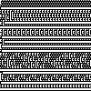

# cellular automata generator (in Go)


[](https://goreportcard.com/report/github.com/eliseduverdier/cellular-automata-go)

Generates [elementary cellular automata](https://en.wikipedia.org/wiki/Elementary_cellular_automaton) images, with 2 to 9 states, or 1st and 2nd order, with customizable size, colors, and points distribution, using Go



**You can see more documentation about Automata and their implementation [here](https://eliseduverdier.github.io/cellular-automata-go/).**

## Use locally

```shell
go run main.go
```

This will generate an image in `images/`

### command line options

Example: `go run main.go -s=5 -o=2 -r=12345 -w=30 -h=10 -render=text` will render the automata #12345 of 2nd order with 5 sates, in text directly to the console, showing 30 columns of characters, and 10 rows.
| option | role |
|---|---|
| s | number of states |
| o | order (1 or 2) |
| r | rule number |
| w | width in pixels |
| h | height in pixels |
| render | 'image' or 'text' |

## Run test

```shell
go test tests/*_test.go
```

## Etc / Help

### Todo

- [ ] add style checker
- [ ] add web server
- [ ] add docker

### install latest go version on ubuntu

```
sudo apt-get purge golang\*
sudo add-apt-repository ppa:longsleep/golang-backports
sudo apt update
sudo apt install golang-go
```
